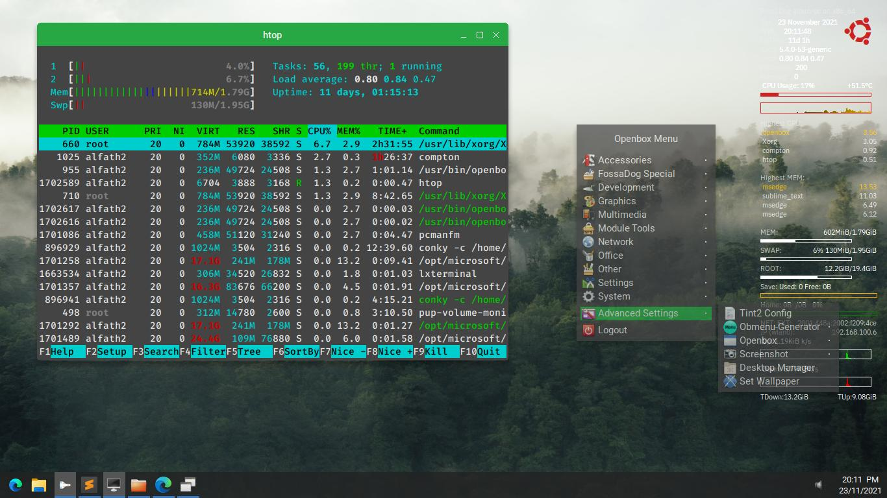
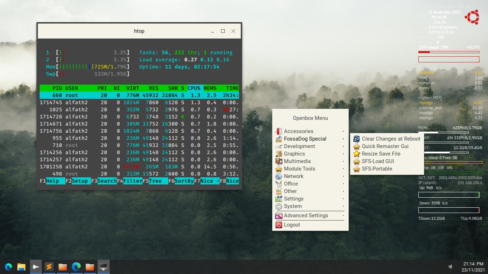
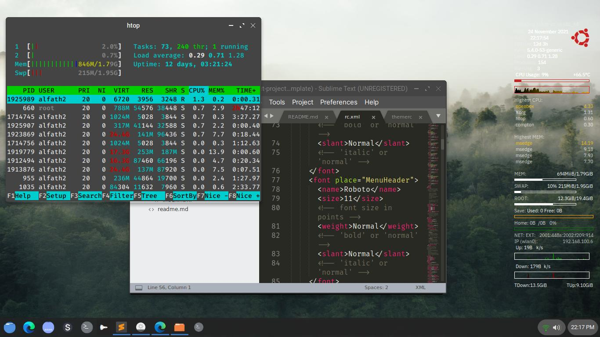

# Openbox Theme Collection
My personal openbox themes collection

## Installation
- Copy the content of 'openbox-theme-alfath' to ~/.themes (for current user) or /usr/share/themes (for all user)
- Apply the themes from obconf  
or
- run the './install.sh'

## Screenshot  
### Simple Black
    
### Simple Blue  
  
### Simple Green  
     
### Arrow  
  
### Ecru  
  
### Skew Arrow
  
