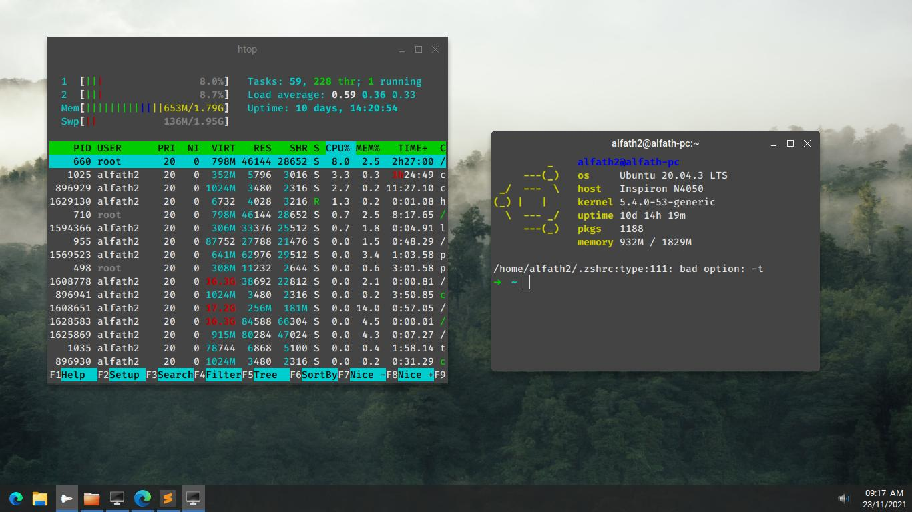
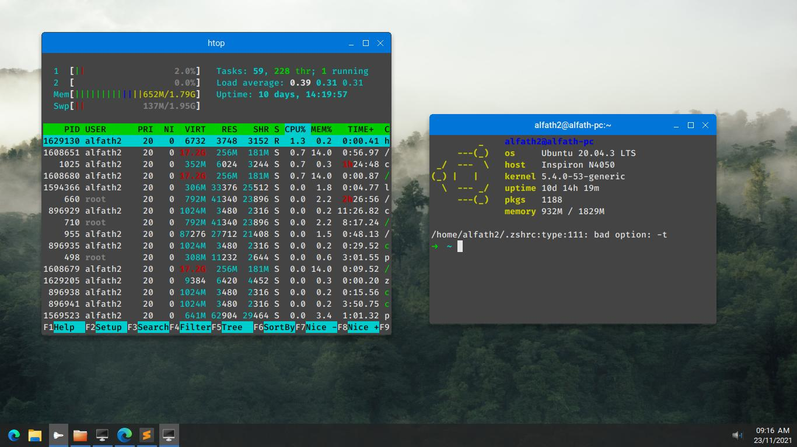
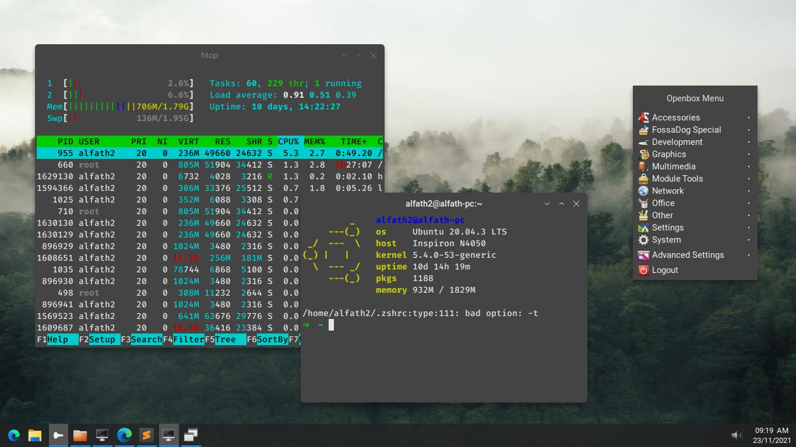

# Openbox Theme Collection
My personal openbox themes collection

## Installation
- Copy to ~/.themes (for current user) or /usr/share/themes (for all user)
- Apply the themes from obconf

## Screenshot  
### Simple Black
  
### Simple Blue
  
### Arrow

